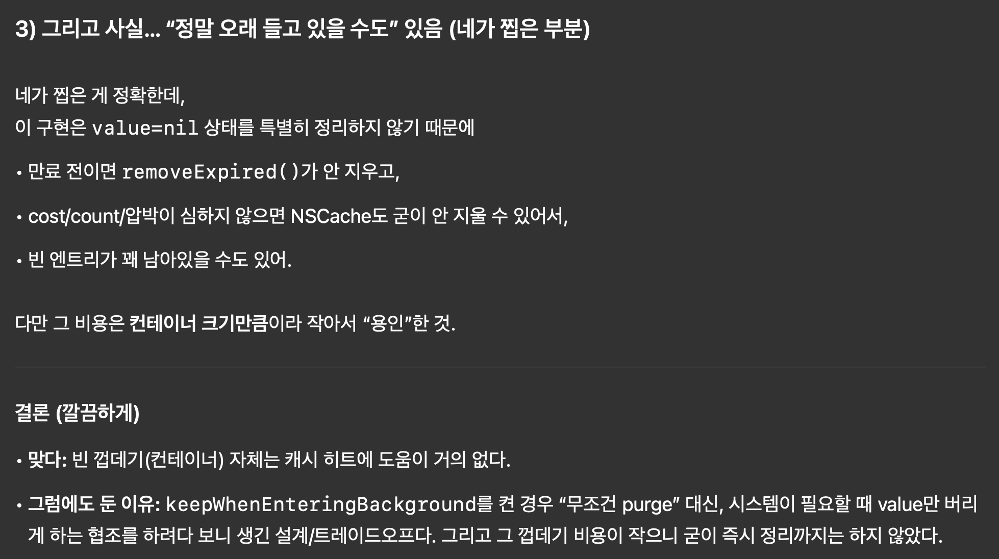

# Kingfisher MemoryStorage 분석

Kingfisher의 MemoryStorage는 "메모리 캐시"라는 단어만 보면 단순히 NSCache 래퍼처럼 보이지만, 실제로는 NSCache의 용량 기반 eviction 위에 시간 기반 만료(expired/TTL) 개념을 얹기 위해 몇 가지 중요한 구조를 추가한 구현이다.

이 글에서는 흐름을 이렇게 가져간다.

1. NSCache의 한계(용량 기반)
2. Kingfisher가 추가한 TTL(expiration) 개념
3. TTL을 가능하게 만든 StorageObject, keys, Timer
4. 동시성(@unchecked Sendable, T: Sendable)과 백그라운드 옵션(NSDiscardableContent)

## NSCache는 용량 기반 캐시

NSCache는 다음 같은 제한을 걸 수 있다.

- `totalCostLimit`: 전체 cost 합이 limit을 넘으면 자동으로 eviction 가능
- `countLimit`: 항목 개수가 limit을 넘으면 자동으로 eviction 가능

즉 NSCache는 메모리 압박/용량을 기준으로 정리하는 캐시다.

그래서인지 NSCache는 기본적으로 시간 기반 만료(TTL) 기능을 제공하지 않는다.

그래서 Kingfisher의 의도는 용량 기반 eviction(NSCache)은 그대로 사용하되, 이미지 캐시에는 TTL(expiration) 개념도 필요하니 추가로 적용하려는 것으로 보여진다!

## MemoryStorage는 네임스페이스, 실체는 Backend

코드에서 MemoryStorage는 enum이지만, 실제로 값을 담는 인스턴스는 아니다.
역할은 관련 타입들을 묶는 네임스페이스에 가깝다.

실제 저장/조회/삭제 동작은 내부 클래스 `Backend<T>`가 담당한다.

```swift
public enum MemoryStorage {

    public final class Backend<T: CacheCostCalculable>: @unchecked Sendable where T: Sendable {

        let storage = NSCache<NSString, StorageObject<T>>()
        var keys = Set<String>()

        private var cleanTimer: Timer? = nil
        private let lock = NSLock()

        public var config: Config { ... }

        public init(config: Config) { ... }

        public func removeExpired() { ... }

        public func store(value: T, forKey key: String, expiration: StorageExpiration? = nil) { ... }
        func storeNoThrow(value: T, forKey key: String, expiration: StorageExpiration? = nil) { ... }

        public func value(forKey key: String, extendingExpiration: ExpirationExtending = .cacheTime) -> T? { ... }

        public func remove(forKey key: String) { ... }
        public func removeAll() { ... }
    }
}
```

## TTL(expiration)을 붙이기 위해 등장한 3요소

Kingfisher가 NSCache 위에 TTL을 얹기 위해 추가한 핵심 요소는 다음 3가지다.

1. **StorageObject**: 값 + 만료 정보를 함께 보관
2. **keys**: 만료 청소를 위해 "내가 넣은 키 목록"을 별도 유지
3. **Timer(cleanTimer)**: 주기적으로 만료 항목을 실제로 제거하는 self-cleaning

### StorageObject: NSCache가 모르는 만료(expired)를 저장하기 위한 래퍼

NSCache는 이 값이 언제 만료되는지를 저장할 곳이 없다.
그래서 Kingfisher는 값을 바로 넣지 않고, StorageObject로 감싼 뒤 NSCache에 넣는다.

```swift
class StorageObject<T> {
    var value: T?
    let expiration: StorageExpiration
    private(set) var estimatedExpiration: Date

    init(_ value: T, expiration: StorageExpiration) {
        self.value = value
        self.expiration = expiration
        self.estimatedExpiration = expiration.estimatedExpirationSinceNow
    }

    func extendExpiration(_ extendingExpiration: ExpirationExtending = .cacheTime) {
        switch extendingExpiration {
        case .none:
            return
        case .cacheTime:
            self.estimatedExpiration = expiration.estimatedExpirationSinceNow
        case .expirationTime(let expirationTime):
            self.estimatedExpiration = expirationTime.estimatedExpirationSinceNow
        }
    }

    var isExpired: Bool {
        return estimatedExpiration.isPast
    }
}
```

그래서 코드를 보면 T(value)와 함께 expiration인 만료 시점도 같이 들고 있는 걸 볼 수 있다.
`isExpired` 프로퍼티가 있는데, 용량 기반 eviction은 NSCache가 하고 시간 기반 만료는 `StorageObject.isExpired`로 Kingfisher가 판단한다는 걸 알 수 있다. 앞으로도 나오겠지만, 저걸 통해서 만료된 애들을 삭제해준다.

### 조회 시점 expired면 삭제가 아니라 nil 반환

조회 함수의 핵심은 이 부분이다.

```swift
public func value(forKey key: String, extendingExpiration: ExpirationExtending = .cacheTime) -> T? {
    guard let object = storage.object(forKey: key as NSString) else {
        return nil
    }
    if object.isExpired {
        return nil
    }
    object.extendExpiration(extendingExpiration)
    return object.value
}
```

- 만료되었으면 NSCache에서 즉시 제거하지 않고, nil을 반환한다.
- 호출자 관점에서는 캐시 미스가 된다 → 기능적으로 목적 달성(만료된 건 사용하지 않음)
- 제거(물리적 정리)는 나중에 수행된다 → 조회 경로를 가볍게 유지(바로 지우면 lock이 걸리면서 성능 저하로 이어짐)

### 만료된 항목을 실제로 지우려면 전체 키 목록이 필요하다 → keys

앞서 설명한대로 KingFisher는 시간 기반으로 데이터를 삭제한다.
그래서 애초에 init시점에 자동으로 일정 주기마다 expired된 object들을 삭제시키고 있다.

```swift
public init(config: Config) {
    self.config = config
    storage.totalCostLimit = config.totalCostLimit
    storage.countLimit = config.countLimit

    cleanTimer = .scheduledTimer(withTimeInterval: config.cleanInterval, repeats: true) { [weak self] _ in
        guard let self = self else { return }
        self.removeExpired()
    }
}
```

`removeExpired()`는 만료된 항목을 실제로 storage에서 제거해야 한다.
그런데 NSCache는 전체 키를 enumerate하는 기능이 없다. 그래서 Backend는 `keys: Set<String>`을 별도로 유지한다.

```swift
public func removeExpired() {
    lock.lock()
    defer { lock.unlock() }

    for key in keys {
        let nsKey = key as NSString
        guard let object = storage.object(forKey: nsKey) else {
            keys.remove(key)
            continue
        }
        if object.isExpired {
            storage.removeObject(forKey: nsKey)
            keys.remove(key)
        }
    }
}
```

### 그런데 왜 keys를 느슨하게 관리할까?

그런데 아까 우리는 조회에서 이런 코드를 봤다.

```swift
if object.isExpired {
    return nil
}
```

아니 만료됐으면 바로 지워버리지, 왜 그냥 nil을 리턴하고 말지?
이때 바로 삭제를 해버리면 추가적인 lock이 들어가게되고 성능이 저하된다고 설명한다.

더불어서 NSCache는 `totalCostLimit`/`countLimit` 때문에 시스템 정책 상 자동 eviction을 하기 때문이다.
사용자 remove 호출이 아니라 NSCache 내부 판단이라, 매번 즉시 추적하려면 추가 동기화가 필요하다.

그래서 Kingfisher는 다음 전략을 택한다.

- 자동 eviction 발생 시점을 실시간으로 추적하지 않는다
- 대신 `removeExpired()` 때 `storage.object(forKey:) == nil`이면
- 이미 NSCache가 지웠구나 하고 그때 keys를 정리한다

결론은 락을 더 추가하지 않고, 청소 타이밍에 한 번에 정리한다(성능 우선)

## cacheCost는 왜 필요할까? (NSCache eviction 품질)

T가 `CacheCostCalculable`을 따라야 하는 이유는 여기에 있다.

```swift
storage.setObject(object, forKey: key as NSString, cost: value.cacheCost)
```

`cacheCost`는 Kingfisher가 직접 계산/정리에 쓰는 값이 아니다.
NSCache에게 "이 객체는 비용이 이만큼이다"라고 알려주기 위한 값이다.

그리고 NSCache는 전체 cost 합이 `totalCostLimit`을 넘으면 내부 정책에 따라 eviction을 할 수 있다.

즉,

- TTL(expiration)은 Kingfisher가 담당
- 용량 기반 eviction은 NSCache가 담당
- `cacheCost`는 NSCache eviction 판단을 돕는 입력

## T: Sendable인데 Backend는 @unchecked Sendable일까?

선언을 다시 보자

```swift
public final class Backend<T: CacheCostCalculable>: @unchecked Sendable where T: Sendable
```

### Backend가 unchecked인 이유

Backend는 NSCache, Timer, NSLock 같은 저장 프로퍼티를 들고 있다.
이런 Foundation 타입들은 컴파일러가 Sendable 안전하다고 증명하지 못하는 경우가 많다.

그래서 `@unchecked Sendable`은 이런 의미다.

- 컴파일러가 증명 못 하는 부분은 작성자가 락/동기화로 안전을 보장한다.

실제로 keys와 청소 로직은 NSLock으로 보호한다.

### 그런데 왜 T는 Sendable로 강제할까?

캐시는 여러 Task/스레드에서 동시에 접근될 수 있다.
`value(forKey:)`는 값을 그대로 호출자에게 전달하고, 그 이후 사용은 캐시가 통제하지 않는다.

따라서 캐시에 들어가는 값 T가 동시성 안전하지 않으면, 캐시가 안전해도 호출자에서 데이터 레이스가 발생할 수 있기 떄문이다.

## keepWhenEnteringBackground: NSDiscardableContent

옵션을 켜면 저장 시점에 감싸는 객체가 달라진다.

```swift
let object: StorageObject<T>
if config.keepWhenEnteringBackground {
    object = BackgroundKeepingStorageObject(value, expiration: expiration)
} else {
    object = StorageObject(value, expiration: expiration)
}
```

`BackgroundKeepingStorageObject`는 다음처럼 구현되어 있다.

```swift
class BackgroundKeepingStorageObject<T>: StorageObject<T>, NSDiscardableContent {
    var accessing = true

    func beginContentAccess() -> Bool {
        accessing = (value != nil)
        return accessing
    }

    func endContentAccess() {
        accessing = false
    }

    func discardContentIfPossible() {
        value = nil
    }

    func isContentDiscarded() -> Bool {
        return value == nil
    }
}
```

`StorageObject`를 상속받은 `NSDiscardableContent`를 준수하는 객체인데,

일반 객체는 eviction의 대상이 될 뿐이지만, `NSDiscardableContent`는 "필요하면 내용만 버릴 수 있는 캐시"로 취급되어 시스템이 더 유연하게 메모리를 회수할 수 있다. 다만 보호가 보장되는 건 아니고, discard되면 이 구현에선 `value = nil`로 사실상 캐시 미스가 된다.

음... 정리해보면 `NSDiscardableContent`을 했다고 해서 백그라운드에서 삭제 우선순위가 일반 객체랑 차이가 있는 건 아니고, Object를 통채로 지우냐, Object안에서 `value = nil`로 value만 지우냐 차이인 것 같다.

근데 이건 결국 시스템이 지우는건데, 뭣하러 이렇게 하는건지 잘 모르겠긴 하다.



쩝...
