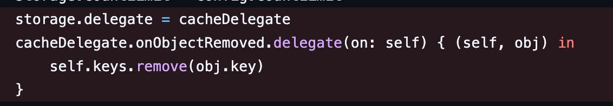

# 1주차 스터디: Storage & MemoryStorage (Kingfisher)

> Kingfisher의 **메모리 캐시(MemoryStorage)**가 왜 `NSCache`를 래핑하고, 어떤 트레이드오프로 설계되었는지 정리한 문서.


## 1. Kingfisher 소개

Kingfisher는 웹에서 이미지를 다운로드하고 캐싱하는 Swift 라이브러리다.

**주요 특징**
- 비동기 이미지 다운로드 및 캐싱
- 메모리 + 디스크 2단계 캐시
- 만료 시간, 용량 제한 등 캐시 정책 제어
- `UIImageView`, `SwiftUI` 등 다양한 확장 지원
- Swift Concurrency 환경에서도 사용 가능 (라이브러리 내부에서 thread-safety 고려)

---

## 2. Kingfisher가 NSCache를 래핑한 이유

`NSCache`는 **캐시 컨테이너로서** 다음 특성이 있다.
- thread-safe하게 설계됨 (여러 스레드에서 접근 가능)
- 시스템 정책/메모리 압박에 따라 자동 eviction 가능
- `countLimit`, `totalCostLimit` 같은 용량 제한 *힌트* 제공
  - 단, “정확히 보장되는 hard limit”이라기보다는 정책 기반 가이드라인에 가까움

**핵심 포인트**
- `NSCache`는 “딱 맞게 저장/삭제를 통제하는 저장소”라기보다,
  **캐시 용도(언제든 사라질 수 있음)에 최적화된 저장소**로 보는 게 안전하다.

### 2.1 NSCache만으로 부족한 점

- **만료(Expiration) 개념이 없음**
  - “5분 지나면 무효” 같은 정책을 `NSCache` 단독으로는 표현하기 어렵다.
- **전체 키 목록을 열거(enumerate)할 수 없음**
  - “현재 들어있는 항목들 중 만료된 것을 훑어서 정리”가 어렵다.
- **eviction은 시스템/NSCache 정책에 좌우됨**
  - 앱이 의도한 타이밍에만 정리되는 형태가 아니다.

### 2.2 Kingfisher가 NSCache 위에 얹은 기능

| NSCache의 부족한 점 | Kingfisher가 보완한 것 |
| --- | --- |
| 만료 시간 관리 부재 | `StorageExpiration` + `StorageObject`로 만료 정책 부여 |
| 전체 키 열거 불가 | `keys: Set<String>`로 “키 인덱스”를 별도로 관리 |
| eviction 정책은 시스템 주도 | `cleanTimer` + `removeExpired()`로 만료 정리를 주기적으로 수행 |
| 비용 기반 제한 필요 | `CacheCostCalculable.cacheCost`로 객체별 cost 관리 |

---

## 3. 핵심 타입 정리

### 3.1 StorageExpiration (만료 정책)

```swift
public enum StorageExpiration: Sendable {
    case never
    case seconds(TimeInterval)
    case days(Int)
    case date(Date)
    case expired
}
```

- 기본값: `.seconds(300)` (5분)

### 3.2 ExpirationExtending (조회 시 만료 연장)

> “LRU처럼 보이게” 만드는 장치. 단, **정확한 LRU 보장**은 아니다.

```swift
public enum ExpirationExtending: Sendable {
    case none
    case cacheTime
    case expirationTime(_ expiration: StorageExpiration)
}
```

- 캐시에서 값을 조회할 때 만료 시간을 갱신하는 정책
- 자주 접근되는 항목이 더 오래 살아남게 되어 LRU에 가까운 효과
- 그러나 `NSCache`가 정책상 다른 항목을 먼저 지울 수 있으므로 strict LRU가 아니다.

### 3.3 CacheCostCalculable (비용 기반 메모리 관리)

```swift
public protocol CacheCostCalculable {
    var cacheCost: Int { get }
}
```

- 이미지 크기는 천차만별이라 **count 기반 제한**만으로는 비효율적
    - `100x100` vs `4000x3000`은 메모리 cost가 다름
- 비용(cost) 기반으로 `NSCache.totalCostLimit`을 활용할 수 있게 한다.

---

## 4. MemoryStorage.Backend 동작 방식

### 4.1 전체 구조

```swift
public enum MemoryStorage {
    public final class Backend<T: CacheCostCalculable>: @unchecked Sendable where T: Sendable {
        let storage = NSCache<NSString, StorageObject<T>>()
        var keys = Set<String>()
        private let lock = NSLock()
        private var cleanTimer: Timer?
    }
}
```

- **실 데이터 저장:** `NSCache`
- **키 인덱스(추적):** `keys: Set<String>`
- **thread-safety:** `NSLock`으로 `keys` 수정 구간 보호
- **만료 정리:** `cleanTimer`가 `removeExpired()`를 주기적으로 호출
  - default: 120초(2분)

### 4.2 Lock 사용 여부 (핵심은 “keys 접근 여부”)

| 메서드 | Lock 사용 | 이유 |
| --- | --- | --- |
| `store` / `storeNoThrow` | ✅ | `keys.insert()`와 `NSCache set`이 논리적으로 한 묶음이어야 함 |
| `value(forKey:)` | ❌ | `keys`를 건드리지 않는 read path(핫패스) 중심 |
| `remove(forKey:)` | ✅ | `keys.remove()` |
| `removeAll()` | ✅ | `keys.removeAll()` |
| `removeExpired()` | ✅ | `keys`를 순회/정리하며 수정함 |

### 4.3 value(forKey:)에서 Lock을 안 쓰는 이유

- `value(forKey:)`는 기본적으로 `NSCache`에서 object를 가져오는 **read path(핫패스)**
- `keys`를 수정하지 않으므로 `keys`에 대한 data race를 만들지 않음
- 성능 관점에서 read path에서 락을 피하는 선택

> 참고: `value(forKey:)` 과정에서 `StorageObject.extendExpiration()`로 내부 만료 시간이 갱신될 수 있어 “엄밀한 의미의 무상태 read”는 아니다. 다만 캐시 도메인에서 성능/복잡도 tradeoff를 택한 것으로 이해하면 된다.

---

## 5. 학습하면서 궁금했던 점들

### Q1. enum을 네임스페이스로 쓰는 이유?

```swift
public enum MemoryStorage {
    public class Backend<T> { ... }
    public struct Config { ... }
}
```

- case 없는 enum은 인스턴스화 불가능
- 논리적으로 관련 타입들을 한 이름 아래로 그룹화
- 전역 네임스페이스 오염 방지, 실수로 인스턴스 생성하는 것 예방

### Q2. cleanTimer에서 weak self를 쓰는 이유?

```swift
cleanTimer = .scheduledTimer(...) { [weak self] _ in
    guard let self = self else { return }
    self.removeExpired()
}
```

- `Timer`는 `RunLoop`에 스케줄되면 반복 실행될 수 있음
- 클로저가 `self`를 strong capture하면 Backend 해제가 어려워질 수 있음
- `weak self`로 Backend가 해제되면 타이머 클로저가 안전하게 종료되도록 함

### Q3. NSCache가 thread-safe인데 왜 Lock이 필요한가?

- `NSCache`는 thread-safe지만, `keys(Set)`는 thread-safe가 아니다.
- 그래서 아래처럼 `cache에 넣는 것`과 `keys에 기록하는 것`이 한 묶음(critical section)이면 락이 필요함.

```swift
func storeNoThrow(...) {
    lock.lock()
    defer { lock.unlock() }

    storage.setObject(object, forKey: key as NSString, cost: value.cacheCost)
    keys.insert(key)
}
```

**문제 상황 예시**

```text
[Thread A]                    [Thread B]
cache.setObject("a")
                              cache.setObject("b")
                              keys.insert("b")
keys.insert("a")

// 이 시점에서:
// - cache에는 "a", "b" 둘 다 있음
// - 하지만 중간에 keys는 "b"만 있던 순간이 있었음
```

- 즉, “cache에는 있는데 keys에는 없는” 유령 상태가 생길 수 있고,
  만료/정리 로직 관점에서는 정합성이 깨질 수 있다.

### Q4. deinit에서 Timer를 정리하지 않는 이유?

일반적으로는 아래처럼 `invalidate()`를 넣는 것이 보수적이다.

```swift
deinit {
    cleanTimer?.invalidate()
}
```

다만 Kingfisher의 기본 사용 패턴은 `ImageCache.default`처럼 **장수 객체(singletone-like)**가 흔하고,
Backend 자체가 앱 라이프타임에 가깝게 살아있는 경우가 많다.

- `weak self`로 Backend 해제 시 클로저는 안전하게 빠져나오지만,
- “타이머 자체를 완전히 멈춘다”는 목적까지 포함하면 `deinit.invalidate()`가 더 명확할 수 있다.

---

## 6. 엔지니어링 설계: [Issue #1233](https://github.com/onevcat/Kingfisher/issues/1233) (2019)

### 6.1 문제 상황

Kingfisher 5.7.0에서 크래시가 발생:
- 별도로 관리하던 `keys`를 수정하다가 다른 스레드와 겹쳐서 크래시

크래시 스택 예시:
- `swift_isUniquelyReferenced_nonNull_native`
- `specialized Set._Variant.remove(_:)`
- `MemoryStorage.Backend.CacheDelegate.cache(_:willEvictObject:)`

### 6.2 핵심 원인

- `NSCache` 자체는 thread-safe
- 그러나 `NSCache` eviction 콜백(`willEvictObject`)에서 **부가 상태(keys Set)**를 mutate
- 동시에 다른 경로(store/remove 등)에서도 keys를 mutate
- eviction 콜백은 **어떤 스레드에서/언제 호출될지 통제 불가**

→ 결과: `Set.remove`에서 동시 수정 충돌로 크래시

### 6.3 기존 방식(문제 가능성이 있던 버전)

- `NSCache` delegate를 붙여 eviction 순간에 **바로 keys에서도 제거**하려고 함
    
- 하지만 eviction 콜백은 “언제/얼마나 자주/어떤 스레드에서” 올지 통제하기 어렵고,
- 그 순간에 `keys`를 lock 없이 건드리면 **충돌 가능성**이 생김
    
    


### 6.4 해결: [PR #1255](https://github.com/onevcat/Kingfisher/pull/1255)

**핵심:** eviction delegate를 제거하고, `keys`는 “느슨하게(eventually)” 정리

현재 코드 주석 요지:
- strict tracking을 깨는 대신 추가 락을 줄이고 캐시 성능을 개선

#### Eventual Consistency 방식 (removeExpired에서 정리)

```swift
public func removeExpired() {
    lock.lock()
    defer { lock.unlock() }

    for key in keys {
        let nsKey = key as NSString

        guard let object = storage.object(forKey: nsKey) else {
            // NSCache 정책(totalCostLimit/countLimit)로 이미 evict된 경우
            // 여기서 keys를 정리
            keys.remove(key)
            continue
        }

        if object.isExpired {
            storage.removeObject(forKey: nsKey)
            keys.remove(key)
        }
    }
}
```

### 6.5 🐯 왜 delegate에 Lock을 추가하지 않았을까?

이론적으로는 “delegate에서도 같은 lock을 잡으면” 동시 수정 문제를 줄일 수 있다.
그런데 Kingfisher는 다른 결정을 했다.

1) eviction 콜백은 예측 불가능한 타이밍/스레드
- 시스템 메모리 압박 상황에서 더 자주 올 수도 있고
- 앱이 바쁜 시점(스크롤/렌더링)과 겹치면 악영향 가능

2) lock 경쟁 증가 가능
- 캐시는 read/write가 잦은 핫패스
- eviction까지 lock 경쟁에 들어오면 성능 저하 위험

3) 캐시의 성격상 strict sync가 필수는 아님
- 캐시는 “언제든 없어질 수 있음”이 기본 가정
- `keys`는 correctness를 보장하는 진실의 원천이라기보다 **관리용 보조 인덱스**

#### 트레이드오프 정리

| 선택 | 장점 | 단점 |
| --- | --- | --- |ㄴ
| delegate + lock로 strict tracking | keys 정합성↑ (evict 즉시 반영) | eviction 타이밍에 따라 lock contention↑ 가능 |
| delegate 제거 + removeExpired에서 정리 (현재) | 안정성↑, 설계 단순화, 핫패스 락 경쟁 감소 | keys가 일시적으로 NSCache 상태와 불일치 가능 |

---

## 마무리

Kingfisher의 메모리 캐시는 `NSCache` 기반이라 정책적으로 오래 유지하려 해도,
OS 메모리 압박이 오면 언제든 eviction될 수 있는 **best-effort 캐시**다.

따라서 설계는 항상 **cache miss를 정상 플로우로 가정**하고,
MemoryStorage는 strict consistency보다 안정성과 성능을 우선한
**‘깨져도 안전한 캐시’**로 귀결된다.
